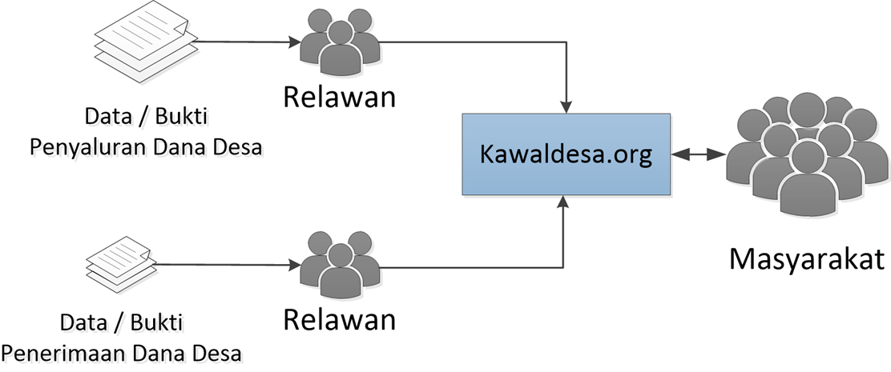
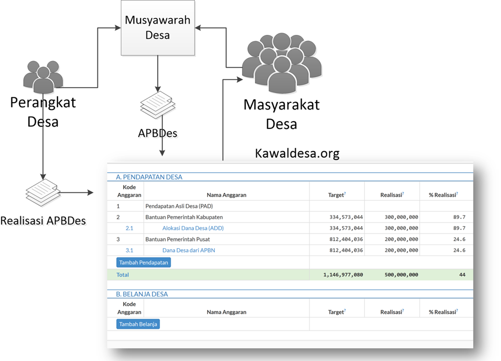
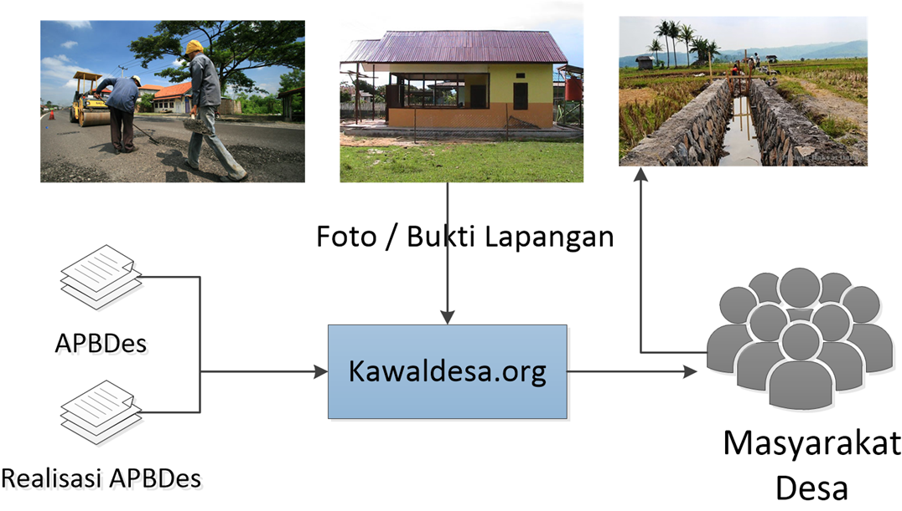

kawaldesa.org
===================================

**Dana Desa**. Peningkatan besarnya dana desa berpotensi besar dalam membangun Indonesia. 

**Crowd Sourcing**. Penyelesaian pekerjaan dengan menggunakan masyarakat/publik sebagai sumber dayanya...

**kawaldesa.org** . Upaya pengawalan dana desa oleh masyarakat agar alokasi, penyaluran dan realisasinya efektif dan efisien, sehingga dampaknya bisa dirasakan kembali ke masyarakat

Crowdsourcing pengawalan dana desa
-----------------------------------

Pengawalan dana desa di kawaldesa.org meliputi:

* Proses alokasi & penganggaran dana desa
* Proses penyaluran dana desa dari Pusat atau Kabupaten/Kota ke Desa.
* Realisasi APBDes oleh pemerintah desa.

.. image:: images/pengawalan.png
   :scale: 50 %
   :alt: alternate text
   :align: right

Pengawalan Alokasi Dana Desa
-----------------------------------
Pembuatan anggaran dana desa dilakukan oleh pemerintah pusat & daerah,
kawaldesa.org menyimpan dan menampilkan anggaran dana desa yang dibuat pemerintah pusat & daerah tersebut

Pengawalan Penyaluran Dana Desa
-----------------------------------

Pengawalan Realisasi APBDes
-----------------------------------

Transparansi anggaran pendapatan & belanja setiap desa, dan realisasinya

Pelaporan masyarakat terhadap realisasi anggaran belanja desa

Organisasi Pelapor
-----------------------------------

