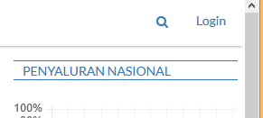
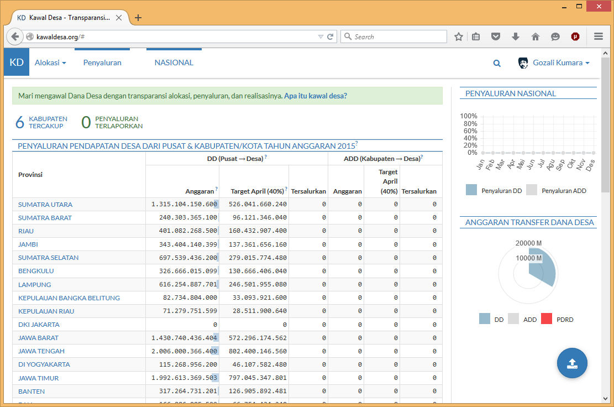
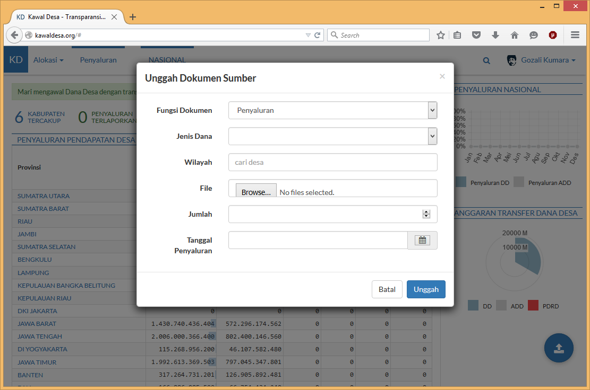
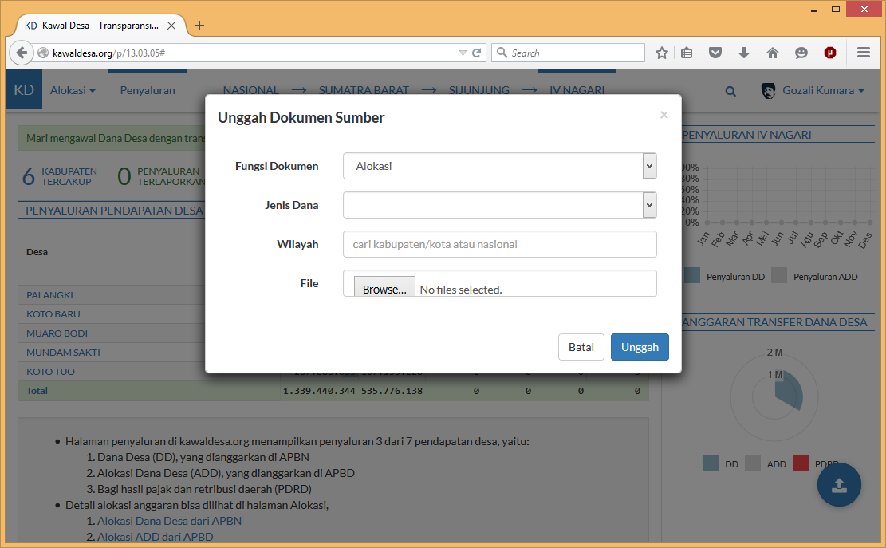
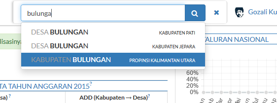
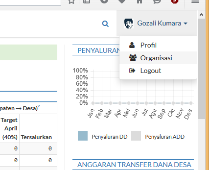
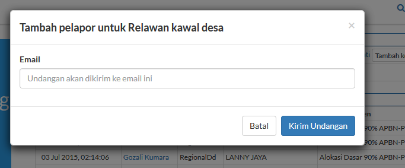

Panduan Penggunaan 
==================

Dokumentasi penggunaan `kawaldesa.org <http://kawaldesa.org>`_

A. Melaporkan penyaluran
-----------------------------------
Setelah membuka kawaldesa.org klik tombol **Login** di **kanan atas** halaman:

------------

Anda kemudian otorisasi oleh **Facebook**, setelah proses login selesai, Anda akan kembali ke kawaldesa.org dengan nama dan foto anda di **kanan atas**:

------------

Di bagian **kanan bawah** halaman terdapat **tombol biru bulat besar**, klik untuk melaporkan
Penyaluran.

Isi form tersebut dengan:

1. Jenis dana yang Anda ingin laporkan, 
2. Dokumen sumber, bila ada,
3. Desa tempat penyaluran, dan
4. Jumlah dan tanggal penyaluran

------------

B. Mengunggah Dokumen Alokasi
-----------------------------------

Klik **tombol biru bulat besar** (setelah Anda login, sama seperti penyaluran) di
kanan bawah halaman. 

Setelah form unggah muncul, ubah fungsi dokumen menjadi Alokasi.

Setelah itu, pilih dokumen yang ingin Anda unggah dan tentukan wilayah alokasi, lalu klik tombol Unggah, tunggu, dan
dokumen Anda berhasil diunggah.

------------

C. Mengisi Spreadsheet Alokasi
-----------------------------------

Cari kabupaten yang ingin anda isi spreadsheetnya dengan menekan tombol Cari di **kanan atas**.

----------

Setelah menemukan kabupaten yang Anda inginkan, klik menu alokasi di **kiri atas**: 

.. image:: images/ss/alloc-menu.png

----------

Lalu klik tombol **+** pada sumber data di halaman yang baru Anda buka, sehingga
kotak informasi tentang dokumen sumber seperti di bawah ini muncul.

.. image:: images/ss/sheet-box.png

-----------

Klik Buka Spreadsheet di Google Sheet, setelah spreadsheet terbuka di google sheet
Anda dapat melihat menu Kawal Desa di add-ons, jika anda telah menginstall add-on
kawaldesa.org untuk Google Sheet

.. image:: images/ss/google-sheet-menu.png

-----------

Anda dapat menerbitkan dokumen dan melihat informasi dokumen dari google sheet.

.. image:: images/ss/google-sheet-sidebar.png

-----------

D. Menambah Pelapor Organisasi
-----------------------------------

Buka halaman organisasi dengan mengklik nama Anda di **kanan atas**.

-----------

Klik tombol **Tambah Pelapor** pada daftar pelapor di halaman tersebut.

.. image:: images/ss/alloc-menu.png

-----------

Tulis email pelapor yang ingin Anda tambah, klik tombol **Kirim Undangan** dan
undangan akan dikirim ke email pelapor tersebut.

