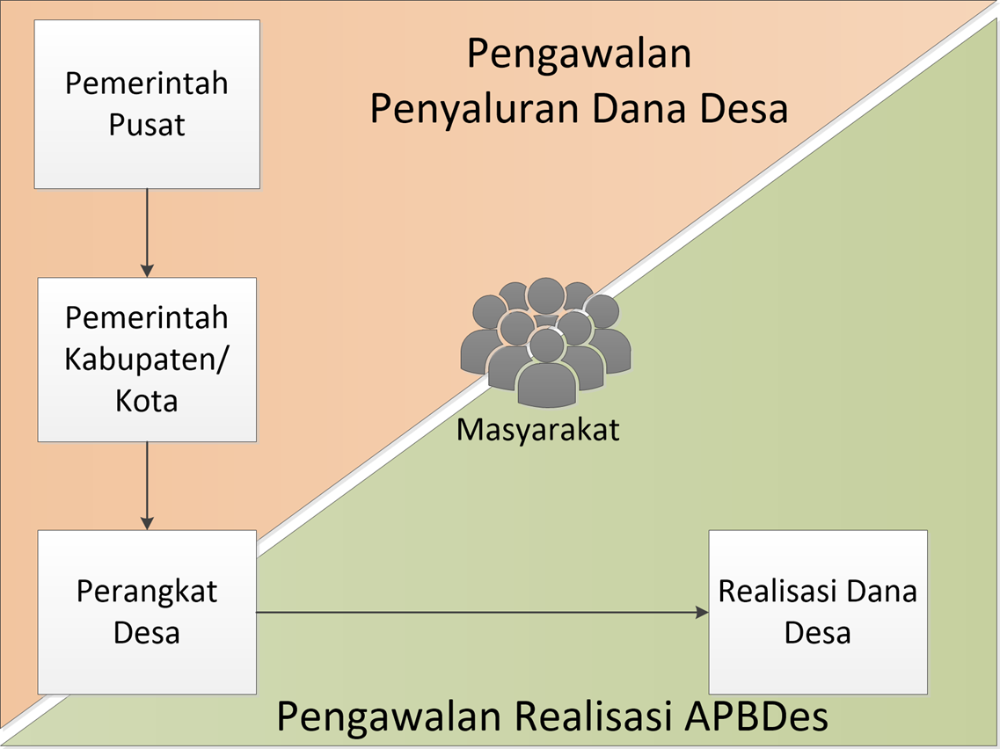

kawaldesa.org
===================================

kawaldesa.org adalah tempat di mana kita bisa mengawal dana desa dengan transparansi alokasi, penyaluran dan realisasinya.

================  ===========================================================
**Alokasi**       | Kita mengawal **pemerintah pusat & daerah** untuk mengalokasikan dana desa sesuai dengan Undang-Undang.
----------------  -----------------------------------------------------------
**Penyaluran**    | Kita mengawal **pemerintah pusat & daerah** untuk menyalurkan dana desa yang dialokasikan agar tepat waktu.
----------------  -----------------------------------------------------------
**Realisasi**     | Kita mengawal **desa-desa** dalam merealisasikan dana desa mereka.
================  ===========================================================

Crowdsourcing pengawalan dana desa
-----------------------------------

Data di kawaldesa.org didapatkan dari organisasi-organisasi pelapor. Daftar organisasi tersebut bisa dilihat di http://kawaldesa.org/orgs

Bagi kamu yang di luar organisasi tersebut namun ingin menyumbang data / merelakan waktu untuk melengkapi data dana desa, kamu bisa bergabung ke facebook page ini: https://www.facebook.com/kawaldesaorg

Organisasi Pelapor
-----------------------------------

Pembuatan anggaran dana desa dilakukan oleh pemerintah pusat & daerah,
kawaldesa.org menyimpan dan menampilkan anggaran dana desa yang dibuat pemerintah pusat & daerah tersebut

